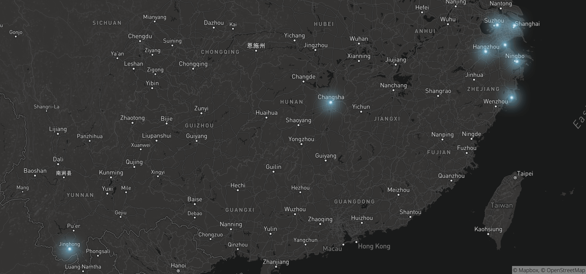

# Hi 👋

**I'm Sorcererxw, keeping creating something.**


<table width="800px">
<tr>
<td valign="top" width="50%">

#### 📊 Monthly Development Breakdown

<!--START_SECTION:waka-->
```text
Go              107 hrs 39 mins █████▓░░░░ 56.58%
TypeScript      65 hrs 48 mins  ███▒░░░░░░ 34.58%
JSON            6 hrs 34 mins   ▒░░░░░░░░░ 3.46%
Protocol Buffer 1 hr 28 mins    ▒░░░░░░░░░ 0.77%
SQL             1 hr 23 mins    ▒░░░░░░░░░ 0.73%
TOML            1 hr 17 mins    ▒░░░░░░░░░ 0.68%
JavaScript      1 hr 11 mins    ▒░░░░░░░░░ 0.63%
Other           1 hr 6 mins     ▒░░░░░░░░░ 0.58%
Markdown        53 mins         ▒░░░░░░░░░ 0.47%
Makefile        41 mins         ▒░░░░░░░░░ 0.36%
```
<!--END_SECTION:waka-->

<td valign="top" width="50%">

#### 💃 Literature and Art

<!--START_SECTION:douban-->
* 📺[看过温泉屋的小老板娘](http://movie.douban.com/subject/30205667/) <code>2021/01/31</code>
* 📚[读过解密 Instagram](https://book.douban.com/subject/35252483/) <code>2021/01/24</code>
* 📚[读过枪炮、病菌与钢铁](https://book.douban.com/subject/1813841/) <code>2021/01/23</code>
* 📺[看过电话](http://movie.douban.com/subject/30346025/) <code>2021/01/03</code>
* 📺[看过泰勒·汤姆林森：青年危机](http://movie.douban.com/subject/34979178/) <code>2021/01/01</code>

<!--END_SECTION:douban-->

</td>
</tr>
<tr>
<td colspan="2">

#### ✈ Footprint



</td>
</tr>
</table>


